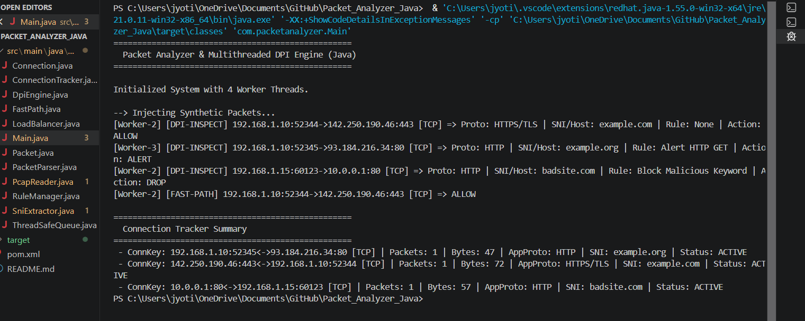

# Packet Analyzer in Java

## Demo



A multithreaded packet analyzer developed in Java that demonstrates packet parsing, Deep Packet Inspection (DPI), connection tracking, rule-based filtering, and load balancing using object-oriented design principles.

---

## Features

- Packet parsing
- Deep Packet Inspection (DPI)
- Connection tracking
- Rule-based packet filtering
- Multithreaded packet processing
- Load balancing
- Fast-path packet optimization
- TLS SNI extraction
- Maven project structure

---

## Technologies Used

- Java 11
- Maven
- Object-Oriented Programming (OOP)
- Multithreading

---

## Project Structure

```text
src/
└── main/
    └── java/
        ├── Main.java
        ├── Packet.java
        ├── PacketParser.java
        ├── Connection.java
        ├── ConnectionTracker.java
        ├── DpiEngine.java
        ├── RuleManager.java
        ├── PcapReader.java
        ├── LoadBalancer.java
        ├── FastPath.java
        ├── SniExtractor.java
        └── ThreadSafeQueue.java
```

---

## How to Run

1. Clone the repository.
2. Open it in IntelliJ IDEA or Eclipse.
3. Import it as a Maven project.
4. Run `Main.java`.

---

## Sample Output

```
Packet Analyzer & Multithreaded DPI Engine

Initialized System with Worker Threads

Injecting Synthetic Packets...

HTTPS Packet -> ALLOW
HTTP Packet -> ALERT
HTTP Packet -> DROP

Connection Summary Generated
```

---

## Future Improvements

- Live packet capture using Pcap4J
- PCAP file analysis
- GUI dashboard
- Export packet analysis reports
- Real-time traffic monitoring

---

## Author

**Jyotiranjan Acharya**